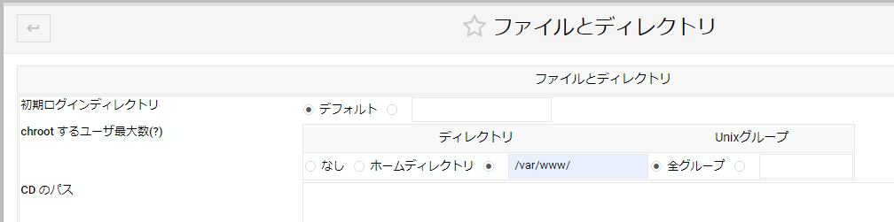

[1.WebARENAの設定](https://github.com/yamamoto-ryuzo/Lizmap-installation-Japanese-memo/blob/main/1.%E4%BB%AE%E6%83%B3%E7%92%B0%E5%A2%83%E3%81%AE%E8%A8%AD%E5%AE%9A.md)   
### 2.WEB環境の構築  Apache

---
#### 2-1.Apache　サーバーの構築  
（step0）最初からやり直したいとき  

sudo apt -y purge apache2 libapache2-mod-fcgid  
sudo apt -y purge php-* php8.2-* libapache2-mod-php8.2  
sudo apt -y autoremove  

（step1）fcgidの設定   
sudo su  
sudo apt -y update  
sudo apt -y upgrade  
sudo apt -y install apache2 libapache2-mod-fcgid  
sudo ufw app list  

 
##### （step2）
**2023-07-24**  
　**LIZMAP3.6 PHPは7.4**  
　https://docs.lizmap.com/current/en/install/linux.html#  
**2023-08-12**  
　Ubuntu22.04+Lizmap3.6においてPHP7.4をインストールしたがどうも物足りんのと怒られた  
　標準のPHP8.0をインストールすると満足してくれたみたいだ！  
 
sudo apt -y update  
sudo apt -y upgrade  

#2023-08-12 実際にはError 500となるのでPHP8をインストール  
#2023-08-12 時点ではPHP8.0なのでその前提で説明  

sudo apt install -y php  

#PHP7.4
sudo apt -y install php7.4-fpm php7.4-cli php7.4-bz2 php7.4-curl php7.4-gd php7.4-intl php7.4-json php7.4-mbstring php7.4-pgsql php7.4-sqlite3 php7.4-xml php7.4-ldap php7.4-redis
sudo apt-get install libapache2-mod-php7.4  

#PHP8.0
sudo apt -y install php8.0-fpm php8.0-cli php8.0-bz2 php8.0-curl php8.0-gd php8.0-intl php8.0-mbstring php8.0-pgsql php8.0-sqlite3 php8.0-xml php8.0-ldap php8.0-redis  
#php8.0-json を明示する必要があるよう  
sudo apt-get install libapache2-mod-php8.0  

---
#### 2-2.Webminをインストール  
（step1）  
sudo apt -y update  
sudo apt -y upgrade  
sudo nano /etc/apt/sources.list  

（step2）  
下記をファイルに追加  
deb http://download.webmin.com/download/repository sarge contrib  

（step3）  
wget -q -O- http://www.webmin.com/jcameron-key.asc | sudo apt-key add  
sudo apt -y update  
sudo apt -y install webmin  

（step4）ファイアウォールを設定  
sudo ufw allow 10000  

---
#### 2-3.Webminを利用  

https:// server-ip:10000/  
でアクセスすると安全ではないといわれるが無視！して接続する。  
 

そもそもrootパスワード設定した記憶がない・・・  

sudo su  
passwd  

でパスワードを設定，ちなみに画面表示がないが，入力は正常に動作しているので気にせず２回入力する。  
Username:root　　Password：設定したパスワード  
  

ここまでくればあとは簡単！  
一応日本語化までを説明  
・「Change Language and Theme」をクリック  
 

・「WebminConfiguration」＞「language and Locale」で「日本語」を選択  
  

・「ハードウェア」＞「システム時間」で「タイムゾーンを変更」を選択  
システム時間を　「Asia/Tokyo」になっているかは再度確認。  
なっていないと，おや～～と思うことが発生します。  

   

---
#### 2-4.ProFTPDの設定  

Webminよりインストール  
　未使用のモジュール　＞　ProFTPDサーバー　＞　InstallNow　　＞　InstallNow  

　 

　サーバー　＞　ProFTPDサーバー　＞　各種設定が可能となっている  
 

ディレクトリを任意に設定  
今回は  /varwww/  

ユーザーを作成  
　システム　＞　ユーザーおよびグループ  
　新しいユーザーを作成　＞　ユーザー名を「lizmapcloud」と入力  
　　　　　　　　　　　　　　ホームディレクトリ「/var/www/lizmap/lizmapcloud」  
　　　　　　　　　　　　　　パスワード「任意に入力」  
所属するグループ-既存グループから「www-data」を選択  
　　　　　　　　　　　　＞作成  

---   
[3.QGISサーバーの設定](https://github.com/yamamoto-ryuzo/Lizmap-installation-Japanese-memo/blob/main/3.QGIS%E3%82%B5%E3%83%BC%E3%83%90%E3%83%BC%E3%81%AE%E8%A8%AD%E5%AE%9A.md)  
[4.PostgreSQLデータベースの構築](https://github.com/yamamoto-ryuzo/Lizmap-installation-Japanese-memo/blob/main/4.PostgreSQL%E3%83%87%E3%83%BC%E3%82%BF%E3%83%99%E3%83%BC%E3%82%B9%E3%81%AE%E6%A7%8B%E7%AF%89.md)  
[5.Lizmap Web Clientの設定](https://github.com/yamamoto-ryuzo/Lizmap-installation-Japanese-memo/tree/main/5.Lizmap%20Web%20Client%E3%81%AE%E8%A8%AD%E5%AE%9A)  
　　[5-1. Lizmap Web Clientのソースコードのインストールと設定](https://github.com/yamamoto-ryuzo/Lizmap-installation-Japanese-memo/blob/main/5.Lizmap%20Web%20Client%E3%81%AE%E8%A8%AD%E5%AE%9A/5-1%20.Lizmap%20Web%20Client%E3%81%AE%E3%82%A4%E3%83%B3%E3%82%B9%E3%83%88%E3%83%BC%E3%83%AB.md)  
　　[5-1-1.インストールエラー　Error in the main configuration.](https://github.com/yamamoto-ryuzo/Lizmap-installation-Japanese-memo/blob/main/5.Lizmap%20Web%20Client%E3%81%AE%E8%A8%AD%E5%AE%9A/5-1-1%E3%82%A4%E3%83%B3%E3%82%B9%E3%83%88%E3%83%BC%E3%83%AB%E3%82%A8%E3%83%A9%E3%83%BC%E3%80%80Error%20in%20the%20main%20configuration.md)  
　　[5-2. Lizmap Web Clientのadminパスワード変更](https://github.com/yamamoto-ryuzo/Lizmap-installation-Japanese-memo/blob/main/5.Lizmap%20Web%20Client%E3%81%AE%E8%A8%AD%E5%AE%9A/5-2.Lizmap%20Web%20Client%E3%81%AE%E5%88%9D%E6%9C%9F%E8%A8%AD%E5%AE%9A.md)  
　　[5-3. Lizmap Web Clientの高速化（PHPのマルチスレッド化）](https://github.com/yamamoto-ryuzo/Lizmap-installation-Japanese-memo/blob/main/5.Lizmap%20Web%20Client%E3%81%AE%E8%A8%AD%E5%AE%9A/5-3.Lizmap%20Web%20Client%E3%81%AE%E9%AB%98%E9%80%9F%E5%8C%96%EF%BC%88PHP%E3%81%AE%E3%83%9E%E3%83%AB%E3%83%81%E3%82%B9%E3%83%AC%E3%83%83%E3%83%89%E5%8C%96%EF%BC%89.md)  
　　[5-4. Lizmap Web Clientの高速化（QGIS Serverのマルチスレッド化）](https://github.com/yamamoto-ryuzo/Lizmap-installation-Japanese-memo/blob/main/5.Lizmap%20Web%20Client%E3%81%AE%E8%A8%AD%E5%AE%9A/5-4.Lizmap%20Web%20Client%E3%81%AE%E9%AB%98%E9%80%9F%E5%8C%96%EF%BC%88QGIS%20Server%E3%81%AE%E3%83%9E%E3%83%AB%E3%83%81%E3%82%B9%E3%83%AC%E3%83%83%E3%83%89%E5%8C%96%EF%BC%89.md)  
　　[5-6. qgis-plugin-managerの設定](https://github.com/yamamoto-ryuzo/Lizmap-installation-Japanese-memo/blob/main/5.Lizmap%20Web%20Client%E3%81%AE%E8%A8%AD%E5%AE%9A/5-5.Lizmap%20Web%20Client%E3%81%AE%E9%AB%98%E9%80%9F%E5%8C%96%EF%BC%88py-qgis-server%E3%81%AE%E5%B0%8E%E5%85%A5%EF%BC%89.md) 
