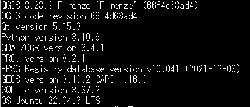
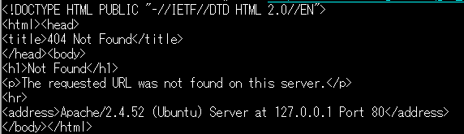
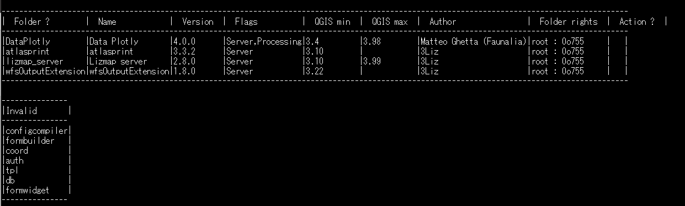
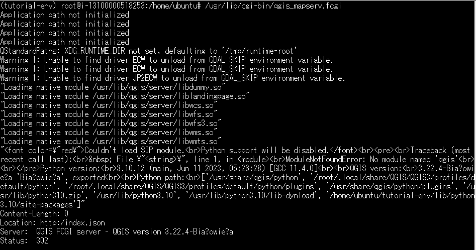

[0. GIS-WEBアプリケーションの選定](https://github.com/yamamoto-ryuzo/Lizmap-installation-Japanese-memo/blob/main/0.%20GIS-WEB%E3%82%A2%E3%83%97%E3%83%AA%E3%82%B1%E3%83%BC%E3%82%B7%E3%83%A7%E3%83%B3%E3%81%AE%E9%81%B8%E5%AE%9A.md)  
[1.WebARENAの設定](https://github.com/yamamoto-ryuzo/Lizmap-installation-Japanese-memo/blob/main/1.%E4%BB%AE%E6%83%B3%E7%92%B0%E5%A2%83%E3%81%AE%E8%A8%AD%E5%AE%9A.md)  
[2.WEB環境の構築](https://github.com/yamamoto-ryuzo/Lizmap-installation-Japanese-memo/blob/main/2.WEB%E7%92%B0%E5%A2%83%E3%81%AE%E6%A7%8B%E7%AF%89.md)  

---
### 3.QGISサーバーの設定  
インストールの本格的な詳細は  
https://docs.qgis.org/3.22/pdf/ja/QGIS-3.22-ServerUserGuide-ja.pdf  
https://docs.qgis.org/3.22/ja/docs/training_manual/qgis_server/install.html  

#### 3-1.QGISサーバーのインストール  
---
今回のQGISserverは3.28だったので、  
https://docs.qgis.org/3.28/ja/docs/training_manual/qgis_server/install.html  
「11.1. Lesson: QGISサーバーをインストールする」により実施  

#最新のリポジトリを設定  
#これでpython3-qgisもインストール可能になる  
sudo apt install gnupg software-properties-common  
sudo wget -O /etc/apt/keyrings/qgis-archive-keyring.gpg https://download.qgis.org/downloads/qgis-archive-keyring.gpg  

nano /etc/apt/sources.list.d/qgis.sources  

#Example for the latest long term release for Ubuntu 22.04 Jammy:  
#以下を記入  
Types: deb deb-src  
URIs: https://qgis.org/ubuntu-ltr  
Suites: jammy  
Architectures: amd64  
Components: main  
Signed-By: /etc/apt/keyrings/qgis-archive-keyring.gpg  
#ここまで  

#再インストールはまず古い環境を削除  
sudo apt -y purge qgis-server  
sudo apt autoremove  

#通常のインストール  
sudo su  
sudo apt -y upgrade  
sudo apt -y update  
sudo apt -y install qgis-server --no-install-recommends --no-install-suggests  
sudo  apt -y install python3-qgis  
#必要なら下記を実行  
apt --fix-broken install  
#最後はお掃除  
sudo apt -y autoremove  

#### 3-2.QGISサーバーのインストール動作確認  
---
#とりあえずサーバーのバージョンを確認してみる  
/usr/lib/cgi-bin/qgis_mapserv.fcgi --version  
  

#この反応からしてQGISサーバーがインストールできているのは明白！  
#動かないのは設定がおかしいから！？  
#基本的な動作テストを行ってみる  
curl http://127.0.0.1/cgi-bin/qgis_mapserv.fcgi  
  
#簡単に言うと動いていない。
#apacheの設定が悪いようだ！

#### 3-3.[QGIS-Plugin-Manager](https://docs.lizmap.com/current/en/install/pre_requirements.html#qgis-server-plugins)のインストール  
---
詳細は https://pypi.org/project/qgis-plugin-manager/  
または https://github.com/3liz/qgis-plugin-manager  

##### pthon3.7以上が必要なので必ずバージョンを確認する必要があり。  
sudo su  
python3 --version  
pip3 install qgis-plugin-manager  
python3 -m pip install qgis-plugin-manager  

#qgis-plugin各アプリインストール先  
#apache2の設定 lizmap-fcgi.conf を設定  
#FcgidInitialEnv QGIS_PLUGINPATH /usr/lib/qgis/plugins

#For security reason, to enable the API on the QGIS server side, you must enable the environment variable  
#Apache FCGI example  
#FcgidInitialEnv QGIS_SERVER_LIZMAP_REVEAL_SETTINGS True  

sudo su  
cd /usr/lib/qgis/plugins  
qgis-plugin-manager update  
qgis-plugin-manager upgrade  
qgis-plugin-manager init  
qgis-plugin-manager install 'Lizmap server'  
qgis-plugin-manager install wfsOutputExtension  
qgis-plugin-manager install atlasprint  
qgis-plugin-manager install 'Data Plotly'  

qgis-plugin-manager upgrade  

#### 3-4.QGIS-Plugin-Managerの動作確認  
---
#インストール状況の確認  
qgis-plugin-manager list  
  

#### 3-3. [QGIS-Plugin-Managerの設定](https://docs.qgis.org/3.22/ja/docs/server_manual/plugins.html)  
---
とりあえずサーバーにプラグインがインストールされていないはこんな感じ？  
「Unknown」って言われる！

#### 3-4.QGISサーバーのテスト 
---
systemctl restart apache2  
/usr/lib/cgi-bin/qgis_mapserv.fcgi  
　を実行！  
　正しくインストールされていると下記のようになるらしい！
  
　詳細は下記を参照  
https://docs.qgis.org/3.22/ja/docs/server_manual/getting_started.html#installation-on-debian-based-systems  

　私の場合はこんな感じ！雰囲気動いているっぽいが、待ちに待った3.22バージョンになっている！Ubuntu22.04で正解！心配なのは302・・・そのうちわかるだろう！  

#### 3-4.QGISサーバーの設定 
---  
Lizmap3.6以上は必ず設定が必要！  
しかもデフォルトと違う設定なので、修正が必要。  
wmsServerURL="http://・・・・"  
  

# ここから  

## QGISの設定 ##  
#### ・Make sure correct environment variables are set in your web server configuration ####  
#### ・for example in Apache2 with mod_fcgid ####  
nano /etc/apache2/mods-available/fcgid.conf  
FcgidInitialEnv QGIS_PLUGINPATH "/srv/qgis/plugins/"  
#### ・Reload server, for example with Apache2 ####  
service apache2 reload  

##### 3-1-3.QGISのログと認証データベースを格納するディレクトリを作成  
mkdir -p /var/log/qgis/  
chown www-data:www-data /var/log/qgis  
mkdir -p /home/qgis/qgisserverdb  
chown www-data:www-data /home/qgis/qgisserverdb  
systemctl restart apache2  

  
---
[4.PostgreSQLデータベースの構築](https://github.com/yamamoto-ryuzo/Lizmap-installation-Japanese-memo/blob/main/4.PostgreSQL%E3%83%87%E3%83%BC%E3%82%BF%E3%83%99%E3%83%BC%E3%82%B9%E3%81%AE%E6%A7%8B%E7%AF%89.md)  
[5.Lizmap Web Clientの設定](https://github.com/yamamoto-ryuzo/Lizmap-installation-Japanese-memo/tree/main/5.Lizmap%20Web%20Client%E3%81%AE%E8%A8%AD%E5%AE%9A)  
　　[5-1. Lizmap Web Clientのソースコードのインストールと設定](https://github.com/yamamoto-ryuzo/Lizmap-installation-Japanese-memo/blob/main/5.Lizmap%20Web%20Client%E3%81%AE%E8%A8%AD%E5%AE%9A/5-1%20.Lizmap%20Web%20Client%E3%81%AE%E3%82%A4%E3%83%B3%E3%82%B9%E3%83%88%E3%83%BC%E3%83%AB.md)  
　　[5-1-1.インストールエラー　Error in the main configuration.](https://github.com/yamamoto-ryuzo/Lizmap-installation-Japanese-memo/blob/main/5.Lizmap%20Web%20Client%E3%81%AE%E8%A8%AD%E5%AE%9A/5-1-1%E3%82%A4%E3%83%B3%E3%82%B9%E3%83%88%E3%83%BC%E3%83%AB%E3%82%A8%E3%83%A9%E3%83%BC%E3%80%80Error%20in%20the%20main%20configuration.md)  
　　[5-2. Lizmap Web Clientのadminパスワード変更](https://github.com/yamamoto-ryuzo/Lizmap-installation-Japanese-memo/blob/main/5.Lizmap%20Web%20Client%E3%81%AE%E8%A8%AD%E5%AE%9A/5-2.Lizmap%20Web%20Client%E3%81%AE%E5%88%9D%E6%9C%9F%E8%A8%AD%E5%AE%9A.md)  
　　[5-3. Lizmap Web Clientの高速化（PHPのマルチスレッド化）](https://github.com/yamamoto-ryuzo/Lizmap-installation-Japanese-memo/blob/main/5.Lizmap%20Web%20Client%E3%81%AE%E8%A8%AD%E5%AE%9A/5-3.Lizmap%20Web%20Client%E3%81%AE%E9%AB%98%E9%80%9F%E5%8C%96%EF%BC%88PHP%E3%81%AE%E3%83%9E%E3%83%AB%E3%83%81%E3%82%B9%E3%83%AC%E3%83%83%E3%83%89%E5%8C%96%EF%BC%89.md)  
　　[5-4. Lizmap Web Clientの高速化（QGIS Serverのマルチスレッド化）](https://github.com/yamamoto-ryuzo/Lizmap-installation-Japanese-memo/blob/main/5.Lizmap%20Web%20Client%E3%81%AE%E8%A8%AD%E5%AE%9A/5-4.Lizmap%20Web%20Client%E3%81%AE%E9%AB%98%E9%80%9F%E5%8C%96%EF%BC%88QGIS%20Server%E3%81%AE%E3%83%9E%E3%83%AB%E3%83%81%E3%82%B9%E3%83%AC%E3%83%83%E3%83%89%E5%8C%96%EF%BC%89.md)  
　　[5-6. qgis-plugin-managerの設定](https://github.com/yamamoto-ryuzo/Lizmap-installation-Japanese-memo/blob/main/5.Lizmap%20Web%20Client%E3%81%AE%E8%A8%AD%E5%AE%9A/5-5.Lizmap%20Web%20Client%E3%81%AE%E9%AB%98%E9%80%9F%E5%8C%96%EF%BC%88py-qgis-server%E3%81%AE%E5%B0%8E%E5%85%A5%EF%BC%89.md)  
