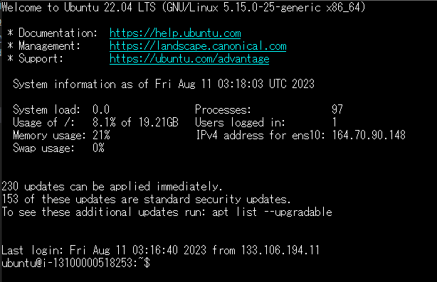

# Dify　ゆかりちゃん
　https://udify.app/chat/ROACB9bjRdLIVwZB
# LIAMAP
 https://github.com/3liz/lizmap-web-client
# インストールメモ
### 1.仮想環境の設定  
#### 1-1.まずは[WebARENA Indigo(Linux)](https://web.arena.ne.jp/indigo/)（例）の申し込み  
---
・申し込みで口座確認のため1000円が一時的に落とされます  
・インスタンス作成，謎の220円が引落し，多分口座確認？  
  
2023-07-24
  https://docs.lizmap.com/current/en/install/linux.html#  
　　LIZMAP3.6には　Ubuntu 20.04 LTS　となっている。 
2023-08-11  
　が、22.04で動いているサイトを確認したので、22.04でチャレンジ！  

  
インスタンスは最安値  
  
SSH鍵の選択（SSH鍵作成で作成してください！）  
  
インスタンス完成（操作＞選択＞インスタンス開始）  
  

#### 1-2.VPSへの接続  
---
・SSH接続でインスタンスにログインする（Indigo）  
SSH接続でインスタンスにログインする（Indigo）  
SSH接続用クライアントソフト(Tera Term等)で、下記を指定し、インスタンスにSSH接続でログインします。  

・ホスト名：作成したインスタンスのIPアドレス  
・ユーザ名：centos または ubuntu  
・パスフレーズ：空白  
・ポート：22  
・鍵：SSH鍵の秘密鍵（private_key.txt > identity）  
・インスタンスのIPアドレスの確認方法：  
[インスタンス管理]→[インスタンス]に移動し、作成したインスタンス名のIPアドレスの欄を確認してください。  
・ユーザ名：  
CentOSの場合、centos　　/　　**Ubuntuの場合、ubuntu**  
・SSH接続用クライアントソフト：Tera Term等  
2023-08-11 Ubuntu 22.04 LTSのインスタンスにSSH接続/ログインできません　に注意！  
https://help.arena.ne.jp/hc/ja/articles/5737789875223-Ubuntu-22-04-LTS%E3%81%AE%E3%82%A4%E3%83%B3%E3%82%B9%E3%82%BF%E3%83%B3%E3%82%B9%E3%81%ABSSH%E6%8E%A5%E7%B6%9A-%E3%83%AD%E3%82%B0%E3%82%A4%E3%83%B3%E3%81%A7%E3%81%8D%E3%81%BE%E3%81%9B%E3%82%93-  

ログイン後、下記のコマンドでroot権限に昇格します。  
sudo su -  
 
・起動画面はこんな感じ  

#### 1-3.とりあえず最新版へ  
---
sudo apt-get -y  update  
sudo apt-get -y  upgrade  
sudo apt -y dist-upgrade  
sudo apt-get -y install update-manager-core  
sudo do-release-upgrade  

（以下，時期によってないかも！）  
途中でこんなの聞いてこられたので「OK」選んでエンターキー  
  
カーネル新しいのあるらしいので「OK」選んでエンターキー  
 
リブートしろと言っているようなので，とにかくリブートして，再度最新版へリトライ！  

その他，とにかくいろいろエンターキー・・・  

#### 1-4.Ubuntuの環境設定（日本語フォント含む）  
---
sudo su  
sudo apt -y autoremove  
sudo apt -y install language-pack-ja-base language-pack-ja  
sudo apt -y install fonts-takao  
sudo apt -y install fonts-ipafont fonts-ipaexfont  
sudo apt -y install ttf-mscorefonts-installer  
dpkg-reconfigure locales  
dpkg-reconfigure tzdata  
sudo apt -y install ntp ntpdate  

　dpkg-reconfigure locales　下記確認，選択を求められます  
　1.ja_JP.UTF-8が選択されているかを確認  
 
 
　2.ja_JP.UTF-8　を選択  
 
 
#### 1-5.毎日丑三つ時、午前2時に再起動の設定  
---
sudo su  
crontab -e  

するとエディターなに使う？と聞いてくるのでコリがない限り，nano　の　「1」　を選択  
  

0 2 * * * /sbin/shutdown -r now  
 

コマンドが追加されているので，#を改行してあげて綺麗に！  
あとは，エディタを　Ctrl+X　で終了し  
Yを選択し  
Enter　を押してファイル保存して終了  

##### 1-6.ログ管理が面倒な人向け
---
定期的なクリーンアップ  
cronジョブを設定して、古いログファイルを定期的に削除することもできます:  
bash  
sudo crontab -e  
以下の行を追加します:  
text  
0 0 * * * find /var/log -type f -mtime +30 -delete  
これにより、30日以上経過したログファイルが毎日削除されます。  
これらの方法を組み合わせることで、/var/logの容量を効果的に制限できます。ただし、重要なログが失われないよう注意が必要です。  

### 2.WEB環境の構築  Apache

---
#### 2-1.Apache　サーバーの構築  
（step0）最初からやり直したいとき  

sudo apt -y purge apache2 libapache2-mod-fcgid  
sudo apt -y purge php-* php8.2-* libapache2-mod-php8.2  
sudo apt -y autoremove  

（step1）fcgidの設定   
sudo su  
sudo apt -y update  
sudo apt -y upgrade  
sudo apt -y install apache2 libapache2-mod-fcgid  
sudo ufw app list  

 
##### （step2）
**2023-07-24**  
　**LIZMAP3.6 PHPは7.4**  
　https://docs.lizmap.com/current/en/install/linux.html#  
**2023-08-12**  
　Ubuntu22.04+Lizmap3.6においてPHP7.4をインストールしたがどうも物足りんのと怒られた  
　標準のPHP8.0をインストールすると満足してくれたみたいだ！  
 
sudo apt -y update  
sudo apt -y upgrade  

#2023-08-12 実際にはError 500となるのでPHP8をインストール  
#2023-08-12 時点ではPHP8.0なのでその前提で説明  

sudo apt install -y php  

#PHP7.4
sudo apt -y install php7.4-fpm php7.4-cli php7.4-bz2 php7.4-curl php7.4-gd php7.4-intl php7.4-json php7.4-mbstring php7.4-pgsql php7.4-sqlite3 php7.4-xml php7.4-ldap php7.4-redis
sudo apt-get install libapache2-mod-php7.4  

#PHP8.0
sudo apt -y install php8.0-fpm php8.0-cli php8.0-bz2 php8.0-curl php8.0-gd php8.0-intl php8.0-mbstring php8.0-pgsql php8.0-sqlite3 php8.0-xml php8.0-ldap php8.0-redis  
#php8.0-json を明示する必要があるよう  
sudo apt-get install libapache2-mod-php8.0  

---
#### 2-2.Webminをインストール  
（step1）  
sudo apt -y update  
sudo apt -y upgrade  
sudo nano /etc/apt/sources.list  

（step2）  
下記をファイルに追加  
deb http://download.webmin.com/download/repository sarge contrib  

（step3）  
wget -q -O- http://www.webmin.com/jcameron-key.asc | sudo apt-key add  
sudo apt -y update  
sudo apt -y install webmin  

（step4）ファイアウォールを設定  
sudo ufw allow 10000  

---
#### 2-3.Webminを利用  

https:// server-ip:10000/  
でアクセスすると安全ではないといわれるが無視！して接続する。  
 

そもそもrootパスワード設定した記憶がない・・・  

sudo su  
passwd  

でパスワードを設定，ちなみに画面表示がないが，入力は正常に動作しているので気にせず２回入力する。  
Username:root　　Password：設定したパスワード  
  

ここまでくればあとは簡単！  
一応日本語化までを説明  
・「Change Language and Theme」をクリック  
 

・「WebminConfiguration」＞「language and Locale」で「日本語」を選択  
  

・「ハードウェア」＞「システム時間」で「タイムゾーンを変更」を選択  
システム時間を　「Asia/Tokyo」になっているかは再度確認。  
なっていないと，おや～～と思うことが発生します。  

   

---
#### 2-4.ProFTPDの設定  

Webminよりインストール  
　未使用のモジュール　＞　ProFTPDサーバー　＞　InstallNow　　＞　InstallNow  

　 

　サーバー　＞　ProFTPDサーバー　＞　各種設定が可能となっている  
 

ディレクトリを任意に設定  
今回は  /varwww/  

ユーザーを作成  
　システム　＞　ユーザーおよびグループ  
　新しいユーザーを作成　＞　ユーザー名を「lizmapcloud」と入力  
　　　　　　　　　　　　　　ホームディレクトリ「/var/www/lizmap/lizmapcloud」  
　　　　　　　　　　　　　　パスワード「任意に入力」  
所属するグループ-既存グループから「www-data」を選択  
　　　　　　　　　　　　＞作成  

### 3.QGISサーバーの設定  
インストールの本格的な詳細は  
https://docs.qgis.org/3.22/pdf/ja/QGIS-3.22-ServerUserGuide-ja.pdf  
https://docs.qgis.org/3.22/ja/docs/training_manual/qgis_server/install.html  

#### 3-1.QGISサーバーのインストール  
---
今回のQGISserverは3.28だったので、  
https://docs.qgis.org/3.28/ja/docs/training_manual/qgis_server/install.html  
「11.1. Lesson: QGISサーバーをインストールする」により実施  

#最新のリポジトリを設定  
#これでpython3-qgisもインストール可能になる  
sudo apt install gnupg software-properties-common  
sudo wget -O /etc/apt/keyrings/qgis-archive-keyring.gpg https://download.qgis.org/downloads/qgis-archive-keyring.gpg  

nano /etc/apt/sources.list.d/qgis.sources  

#Example for the latest long term release for Ubuntu 22.04 Jammy:  
#以下を記入  
Types: deb deb-src  
URIs: https://qgis.org/ubuntu-ltr  
Suites: jammy  
Architectures: amd64  
Components: main  
Signed-By: /etc/apt/keyrings/qgis-archive-keyring.gpg  
#ここまで  

#再インストールはまず古い環境を削除  
sudo apt -y purge qgis-server  
sudo apt autoremove  

#通常のインストール  
sudo su  
sudo apt -y upgrade  
sudo apt -y update  
sudo apt -y install qgis-server --no-install-recommends --no-install-suggests  
sudo  apt -y install python3-qgis  
#必要なら下記を実行  
sudo apt --fix-broken install  
#最後はお掃除  
sudo apt -y autoremove  

#### 3-2.QGISサーバーのインストール動作確認  
---
#とりあえずサーバーのバージョンを確認してみる  
/usr/lib/cgi-bin/qgis_mapserv.fcgi --version  
  

#この反応からしてQGISサーバーがインストールできているのは明白！  
#動かないのは設定がおかしいから！？  
#基本的な動作テストを行ってみる  
curl http://127.0.0.1/cgi-bin/qgis_mapserv.fcgi  
  
#簡単に言うと動いていない。
#apacheの設定が悪いようだ！

#### 3-3.[QGIS-Plugin-Manager](https://docs.lizmap.com/current/en/install/pre_requirements.html#qgis-server-plugins)のインストール  
---
詳細は https://pypi.org/project/qgis-plugin-manager/  
または https://github.com/3liz/qgis-plugin-manager  

##### pthon3.7以上が必要なので必ずバージョンを確認する必要があり。  
sudo su  
python3 --version  
pip3 install qgis-plugin-manager  
python3 -m pip install qgis-plugin-manager  

#qgis-plugin各アプリインストール先  
#apache2の設定 lizmap-fcgi.conf を設定  
#FcgidInitialEnv QGIS_PLUGINPATH /usr/lib/qgis/plugins

#For security reason, to enable the API on the QGIS server side, you must enable the environment variable  
#Apache FCGI example  
#FcgidInitialEnv QGIS_SERVER_LIZMAP_REVEAL_SETTINGS True  

sudo su  
cd /usr/lib/qgis/plugins  
qgis-plugin-manager update  
qgis-plugin-manager upgrade  
qgis-plugin-manager init  
qgis-plugin-manager install 'Lizmap server'  
qgis-plugin-manager install wfsOutputExtension  
qgis-plugin-manager install atlasprint  
qgis-plugin-manager install 'Data Plotly'  

qgis-plugin-manager upgrade  

#### 3-4.QGIS-Plugin-Managerの動作確認  
---
#インストール状況の確認  
qgis-plugin-manager list  
  

#### 3-3. [QGIS-Plugin-Managerの設定](https://docs.qgis.org/3.22/ja/docs/server_manual/plugins.html)  
---
とりあえずサーバーにプラグインがインストールされていないはこんな感じ？  
「Unknown」って言われる！

#### 3-4.QGISサーバーのテスト 
---
systemctl restart apache2  
/usr/lib/cgi-bin/qgis_mapserv.fcgi  
　を実行！  
　正しくインストールされていると下記のようになるらしい！
  
　詳細は下記を参照  
https://docs.qgis.org/3.22/ja/docs/server_manual/getting_started.html#installation-on-debian-based-systems  

　私の場合はこんな感じ！雰囲気動いているっぽいが、待ちに待った3.22バージョンになっている！Ubuntu22.04で正解！心配なのは302・・・そのうちわかるだろう！  

#### 3-4.QGISサーバーの設定 
---  
Lizmap3.6以上は必ず設定が必要！  
しかもデフォルトと違う設定なので、修正が必要。  
wmsServerURL="http://・・・・"  
  

## QGISの設定 ##  
#### ・Make sure correct environment variables are set in your web server configuration ####  
#### ・for example in Apache2 with mod_fcgid ####  
nano /etc/apache2/mods-available/fcgid.conf  
FcgidInitialEnv QGIS_PLUGINPATH "/srv/qgis/plugins/"  
#### ・Reload server, for example with Apache2 ####  
service apache2 reload  

##### 3-1-3.QGISのログと認証データベースを格納するディレクトリを作成  
mkdir -p /var/log/qgis/  
chown www-data:www-data /var/log/qgis  
mkdir -p /home/qgis/qgisserverdb  
chown www-data:www-data /home/qgis/qgisserverdb  
systemctl restart apache2  

### 4.PostgreSQLデータベースの構築  
#### 4-1.PostgreSQLデータベースのインストール  
Webminよりインストール  
　未使用のモジュール　＞　PostgreSQLデータベースサーバー  
　＞　InstallNow　　＞　InstallNow  
#### 4-2.postgresアカウントのパスワード設定  
Webminよりインストール  

　サーバー　＞　PostgreSQLデータベースサーバー　＞　PostgreSQLユーザー  
　＞　ユーザー名：postgresを選択　＞　パスワード設定　＞　保存  
#### 4-3.lizmap追加アカウントの設定  
Webminより設定  

　サーバー　＞　PostgreSQLデータベースサーバー　＞　PostgreSQLユーザー  
　　　　　　＞　新規ユーザーを作成  
　＞　ユーザー名：lizmap，パスワード設定，データベースの作成を可能を選択  

 

 

#### 4-4.Lizmapデータベースの作成  
Webminよりインストール  
　サーバー　＞　PostgreSQLデータベースサーバー　＞　新規データベースを作成  
　　　　　　＞　データベース名，オーナー：Lizmap　＞　作成  
   

 
#### 4-5.設定ファイルの編集  
##### UBUNTU	/etc/postgresql/VERSION/main/postgresql.conf の修正  
　今回のバージョンは14.8だったので　14　で入力  
nano /etc/postgresql/14/main/postgresql.conf  

　に　listen_addresses = '*'　を追加  
 　外部接続をしない場合は'localhost'  
　　　max_connections = 1000　に修正  
  

##### UBUNTU	/etc/postgresql/VERSION/main/pg_hba.conf　を下記に書き換え  
　今回のバージョンは14.8だったので　14　で入力  
nano /etc/postgresql/14/main/pg_hba.conf  

local	all all 							trust  
host	all all 127.0.0.1	255.255.255.255	md5  
host	all all 0.0.0.0/0					md5  
host	all all ::1/128						md5  
hostssl all all 127.0.0.1	255.255.255.255	md5  
hostssl all all 0.0.0.0/0					md5  
hostssl all all ::1/128						md5  

#### 4-6.空からのLIZMAP用データベースの作成
#### PostGIS等拡張機能のインストーと初期インストールの確認  
Webminより空のデータベース「lizmap」を作成  
　サーバー　＞　PostgreSQLデータベースサーバー　＞　新規データベースを作成  
  

[pgAdmin](https://www.pgadmin.org/)よりインストール  
　今回のバージョンは14.8だったので　14　で入力  
　sudo apt -y install postgis postgresql-VERSION-postgis-3  

sudo apt -y update  
sudo apt -y install postgis postgresql-14-postgis-3  

　**ログインは　postgres：スーパーユーザーで行う必要あり**  
　拡張　を　右クリック　＞　作成　＞　拡張　＞「postgis」を選択　＞保存  
　　　　　　　　　　　　　　　　　　　　　　＞「pg_trgm」を選択　＞保存  
  　　　　　　　　　　　　　　　　　　　　　＞「unaccent」を選択　＞保存  
「pg_trgm」「unaccent」はLizmapの検索機能で必要です。  

  

  
#### 5-1.Lizmap Web Clientのインストール  
　シンボリックリンクを http://localhost/lizmap/ に設定する  
　現在のバージョンは 3liz/lizmap-web-client: Transfer a QGIS project on a server, Lizmap is providing the web interface to browse it (github.com) で確認。  

### step-1  
---
https://github.com/3liz/lizmap-web-client/releases  
で最新バージョンを確認  

##### (step1-VERSION=3.8.1)  
sudo su  
cd /var/www/  
VERSION=3.8.1  
#既存ディレクトリの強制削除  
rm -rf /var/www/lizmap-web-client-$VERSION  
wget https://github.com/3liz/lizmap-web-client/releases/download/$VERSION/lizmap-web-client-$VERSION.zip  

#-o	ファイルを確認なしに上書きする  
unzip -o lizmap-web-client-$VERSION.zip  
# Lizmap本体参照のためのシンポリックリンク　の作成  
rm /var/www/html/lizmap  
ln -s /var/www/lizmap-web-client-$VERSION/lizmap/www/ /var/www/html/lizmap  
rm lizmap-web-client-$VERSION.zip  
chown -R www-data:www-data /var/www/lizmap-web-client-$VERSION  

### step-2  
---
##### (step2)  
cd /var/www/lizmap-web-client-$VERSION/  
cd lizmap/var/config  
cp lizmapConfig.ini.php.dist lizmapConfig.ini.php  
cp localconfig.ini.php.dist localconfig.ini.php  
cp profiles.ini.php.dist profiles.ini.php  
cd ../../..  
#PHP スクリプトが一時ファイルを書き込んだり、変更を加えたりできるようにします。  
lizmap/install/set_rights.sh www-data www-data  

### step-3  
---
#####  (step3-初めてのインストール：バージョンアップは(step3-アップデート） へ）  
#ホームページMediaフォルダ参照のためのシンポリックリンク　の作成  
ln -s /var/www/lizmap/ /var/www/lizmap-web-client-$VERSION/lizmap/www/izmap_symlink  

#Postgresqlデータベースにアクセスするためのいくつかのパラメータを指定  
nano /var/www/lizmap-web-client-$VERSION/lizmap/var/config/profiles.ini.php  
#　下記項目を置き換え  

[jdb:jauth]  
driver=pgsql  
host=localhost  
port=5432  
database="lizmap"  
user=postgres  
password=***  
search_path=public  

[jdb:lizlog]  
driver=pgsql  
host=localhost  
port=5432  
database="lizmap"  
user=postgres  
password=***  
search_path=public  

#インストーラーの起動  
#ver3.6からはphp lizmap/install/configurator.phpも追加  
php /var/www/lizmap-web-client-$VERSION/lizmap/install/configurator.php  

  
#インストールはpostgresの初期設定含む  
#lizmapデータベースにいろいろ追加されている  
php /var/www/lizmap-web-client-$VERSION/lizmap/install/installer.php  

  

#####  (step3-アップデート）  
#設定を引き継ぐバージョンを記入ください。  
#各自変更してください  
old_VERSION=3.7.10  
    
#ホームページMediaフォルダ参照のためのシンポリックリンク　の作成  
ln -s /var/www/lizmap/ /var/www/lizmap-web-client-$VERSION/lizmap/www/lizmap_symlink  
  
#var/config/liveconfig.ini.php　は更新してはいけません。なぜなら，app/system/mainconfig.ini.php のパラメータを含んでおり、アプリケーション自体によって変更されるものです。  
  
cp -f /var/www/lizmap-web-client-$old_VERSION/lizmap/var/config/profiles.ini.php /var/www/lizmap-web-client-$VERSION/lizmap/var/config/profiles.ini.php  

cp -f /var/www/lizmap-web-client-$old_VERSION/lizmap/var/config/lizmapConfig.ini.php  /var/www/lizmap-web-client-$VERSION/lizmap/var/config/lizmapConfig.ini.php  

cp -f /var/www/lizmap-web-client-$old_VERSION/lizmap/var/config/localconfig.ini.php  /var/www/lizmap-web-client-$VERSION/lizmap/var/config/localconfig.ini.php  
  
#初期/Landingページのコンテンツ　のコピー  
cp -f -r /var/www/lizmap-web-client-$old_VERSION/lizmap/var/lizmap-theme-config/ /var/www/lizmap-web-client-$VERSION/lizmap/var/  

### 基本プラグインのアップデートは常にした方がいい感じ！  
### [3.6→3.7(3.7.6→3.7.10)などのアップグレードの場合はこちらも！](./5-1-2.インストールエラー　The%20application%20is%20not%20installed.md)  
### **[プラグインも再インストール(3-3.QGIS-Plugin-Managerのインストール参照)](https://github.com/yamamoto-ryuzo/Lizmap-installation-Japanese-memo/blob/main/3.QGIS%E3%82%B5%E3%83%BC%E3%83%90%E3%83%BC%E3%81%AE%E8%A8%AD%E5%AE%9A.md#3-3qgis-plugin-manager%E3%81%AE%E3%82%A4%E3%83%B3%E3%82%B9%E3%83%88%E3%83%BC%E3%83%AB)**  

### アップデートの時はここでWEBサーバーを最新版に更新して、リセット  
### 終了です!  
sudo service apache2 restart  

### 失敗したら元に戻す  
sudo su
rm /var/www/html/lizmap  
ln -s /var/www/lizmap-web-client-$old_VERSION/lizmap/www/ /var/www/html/lizmap  
sudo service apache2 restart  

### step-4  
---
##### (lizmap-fcgi.conf　の作成)  
cd lizmap
（編集内容）  
FcgidInitialEnv SCRIPT_FILENAME /usr/lib/cgi-bin/qgis_mapserv.fcgi  
#FcgidInitialEnv QGIS_SERVER_LOG_FILE /opt/lizmap/data/qgis/qgisserver.log  
#FcgidInitialEnv QGIS_SERVER_LOG_LEVEL 0  
#FcgidInitialEnv QGIS_DEBUG 1  
#FcgidInitialEnv QGIS_AUTH_DB_DIR_PATH /opt/lizmap/data/qgis  
#FcgidInitialEnv QGIS_AUTH_PASSWORD_FILE /opt/lizmap/data/qgis/qgis-auth.db  
#バージョンに左右さえない位置としたいがいろいろいいことにならない  
#FcgidInitialEnv QGIS_PLUGINPATH /var/www/lizmap-plugins  
#今回は以下を利用  
FcgidInitialEnv QGIS_PLUGINPATH /usr/lib/qgis/plugins  
#QGISサーバー側のすべての機能を有効にする  
#FcgidInitialEnv QGIS_SERVER_LIZMAP_REVEAL_SETTINGS True  
#FcgidInitialEnv PGPASSFILE /opt/lizmap/data/qgis/.pgpass  
#FcgidInitialEnv PGSERVICEFILE /opt/lizmap/data/qgis/.pg_service.conf  
#QGISのマルチスレッド化  
#並列レンダリングがアクティブ化されたときに使用するスレッドの数。  
#値が指定されている場合は、プロセッサ コアの数を使用します。-1  
FcgidInitialEnv QGIS_SERVER_MAX_THREADS 10  

#WMS GetMap 要求の並列レンダリングをアクティブにします。  
#デフォルトでは() は無効になっています。使用可能な値は次のとおりです。false  
#0または (大文字と小文字を区別しない)false  
#1または (大文字と小文字を区別しない)true  
FcgidInitialEnv QGIS_SERVER_PARALLEL_RENDERING 1  

### step-5  
---
#### Apache2の設定（QGIS Server Plugin含む）  
・000-default.conf　の設定  
nano /etc/apache2/sites-available/000-default.conf  

下記を追加  

Include conf-available/lizmap-fcgi.conf  
Include conf-available/serve-cgi-bin.conf  

sudo systemctl restart apache2  

 

## 5-1-1.インストールエラー　Error in the main configuration
#### エラー内容
Error 500. A technical error has occured.  
Error in the main configuration.

## とにかくやってみる場合
　3.7.0からのアップデートはこれが必要でした。  
#### lizmap-web-client　再インストール  
cd /var/www/lizmap-web-client-3.7.6/  
php lizmap/install/configurator.php  
php lizmap/install/installer.php  

## 真面目に原因を調べる必要のある場合  
#### エラーログ  

2022-06-21 20:36:24	223.133.253.183	[1024]	Error in main configuration on pluginsPath -- Path given in pluginsPath for the module jacl2db is ignored, since this module is unknown or deactivated	/var/www/lizmap-web-client-3.5.3/lib/jelix/core/jConfigCompiler.class.php	470
	/
array ( )
2022-06-21 20:36:24	223.133.253.183	[7]	Error in the main configuration. A plugin doesn't exist -- The coord plugin jacl2 is unknown.	/var/www/lizmap-web-client-3.5.3/lib/jelix/core/jConfigCompiler.class.php	206

↑　何がおかしいのか　＝　jelix（jacl2db）が気に入らない？　＝　PHP　も怪しい？？？  
↑　それってどういう意味　＝　要するにインストールがうまくいっていない  

### PHPが気に入らないとき
---
  

### PHPの再インストール  

#### 対応策  まずは古いPHPのアンインストール  
sudo su  
#PHPのアンインストール  
#purgeで設定も含めて削除  
sudo apt-get -y purge 'php*'  
sudo apt -y autoremove  

#### 2022-08-12 /lizmap-web-client-3.6.5　の場合はこちら  
#PHPの再インストール  
sudo apt -y install php8.2-fpm php8.2-cli php8.2-bz2 php8.2-curl php8.2-gd php8.2-intl php8.2-mbstring php8.2-pgsql php8.2-sqlite3 php8.2-xml php8.2-ldap php8.2-redis  
#php8.2-json を明示する必要があるよう  
sudo apt-get install libapache2-mod-php8.2  

#### 2022-06-21 /lizmap-web-client-3.5　の場合はこちら  
#PHPの再インストール  
#PHP7.3にしたい場合
sudo su  
apt search php7.3-*  
sudo apt-get -y install php7.3-fpm php7.3-cli php7.3-bz2 php7.3-curl php7.3-gd php7.3-intl php7.3-mbstring php7.3-pgsql php7.3-sqlite3 php7.3-xml php7.3-ldap  
sudo apt-get install libapache2-mod-php7.3  

## 参考 ##  
https://github.com/jelix/jelix/issues/314  

## 5-1-1.インストールエラー　Error in the main configuration
#### エラー内容
Error 500. A technical error has occured.  
Error in the main configuration.

## とにかくやってみる場合
　3.7.0からのアップデートはこれが必要でした。  
#### lizmap-web-client　再インストール  
cd /var/www/lizmap-web-client-3.7.6/  
php lizmap/install/configurator.php  
php lizmap/install/installer.php  

## 真面目に原因を調べる必要のある場合  
#### エラーログ  

2022-06-21 20:36:24	223.133.253.183	[1024]	Error in main configuration on pluginsPath -- Path given in pluginsPath for the module jacl2db is ignored, since this module is unknown or deactivated	/var/www/lizmap-web-client-3.5.3/lib/jelix/core/jConfigCompiler.class.php	470
	/
array ( )
2022-06-21 20:36:24	223.133.253.183	[7]	Error in the main configuration. A plugin doesn't exist -- The coord plugin jacl2 is unknown.	/var/www/lizmap-web-client-3.5.3/lib/jelix/core/jConfigCompiler.class.php	206

↑　何がおかしいのか　＝　jelix（jacl2db）が気に入らない？　＝　PHP　も怪しい？？？  
↑　それってどういう意味　＝　要するにインストールがうまくいっていない  

### PHPが気に入らないとき
---
  

### PHPの再インストール  

#### 対応策  まずは古いPHPのアンインストール  
sudo su  
#PHPのアンインストール  
#purgeで設定も含めて削除  
sudo apt-get -y purge 'php*'  
sudo apt -y autoremove  

#### 2022-08-12 /lizmap-web-client-3.6.5　の場合はこちら  
#PHPの再インストール  
sudo apt -y install php8.2-fpm php8.2-cli php8.2-bz2 php8.2-curl php8.2-gd php8.2-intl php8.2-mbstring php8.2-pgsql php8.2-sqlite3 php8.2-xml php8.2-ldap php8.2-redis  
#php8.2-json を明示する必要があるよう  
sudo apt-get install libapache2-mod-php8.2  

#### 2022-06-21 /lizmap-web-client-3.5　の場合はこちら  
#PHPの再インストール  
#PHP7.3にしたい場合
sudo su  
apt search php7.3-*  
sudo apt-get -y install php7.3-fpm php7.3-cli php7.3-bz2 php7.3-curl php7.3-gd php7.3-intl php7.3-mbstring php7.3-pgsql php7.3-sqlite3 php7.3-xml php7.3-ldap  
sudo apt-get install libapache2-mod-php7.3  

## 参考 ##  
https://github.com/jelix/jelix/issues/314  

## 5-1-2.インストールエラー　The application is not installed  
#### エラー内容
Error 500. A technical error has occured. Sorry for this trouble.  
The application is not installed  

#簡単に言うとインストールされてないと怒っている！

### アップグレードに伴いインストールが必要！
---
#今回は【3.6から3.7】　【3.7から3.8】  
#今回は【3.76から3.7.10】　も必要だった  
#https://docs.lizmap.com/3.7/ja/install/upgrade.html  

#3.8へのアップグレード

sudo su  
VERSION=3.8.1  

cd /var/www/lizmap-web-client-$VERSION  
sudo lizmap/install/clean_vartmp.sh  
php lizmap/install/configurator.php  
php lizmap/install/installer.php  
sudo lizmap/install/clean_vartmp.sh  
sudo lizmap/install/set_rights.sh www-data www-data  

## 5-1-2.インストールエラー　トップページは動くが実際に地図表示がされない  
#### エラー内容
　Maps cannot be displayed. Please check the server information panel.  
  

#### 簡単に言うとバージョンアップに伴いほかのシステムのバージョンアップが必要  
3.7.0＞＞＞3.7.6の場合  
lizmapServerのアップデータが必要だった！  
なのでプラグイン一式をアップデート  

sudo su  
cd /usr/lib/qgis/plugins  
qgis-plugin-manager update  
qgis-plugin-manager upgrade  
qgis-plugin-manager upgrade  
sudo service apache2 restart  

　

#### 5-2.Lizmap Web Clientの初期設定
http://lizmap.yamakun.net/lizmap/  
　 
  
接続　＞　ユーザー名，パスワード共に初期設定は「admin」  
 

管理　＞　ユーザー　＞　admin    表示　＞　パスワードを変更する　＞　保存  

   

 
##### 5-2-1.コンテンツ用領域の作成  

sudo su   
cd /var/www  
mkdir lizmap  
chown www-data:www-data lizmap  

##### 5-2-2.リポジトリの作成  
リポジトリ「lizmapcloud」の作成例  
mkdir  lizmap/lizmapcloud  
chown lizmapcloud:www-data lizmapcloud  

#### 5-3.Lizmap Web Clientの高速化（PHPのマルチスレッド化）  
(STEP１)  
sudo su  
apt -y install php-fpm  

vi /etc/apache2/sites-available/default-ssl.conf  
#バージョンはその都度確認の事　今回は8.0でした。  
#<VirtualHost> - </VirtualHost> 内に追記  
    <FilesMatch \.php$>  
        SetHandler "proxy:unix:/var/run/php/php8.0-fpm.sock|fcgi://localhost/"  
    </FilesMatch>  

a2enmod proxy_fcgi setenvif  
a2enconf php8.0-fpm  
systemctl restart php8.0-fpm apache2  

echo '<?php phpinfo(); ?>' > /var/www/html/lizmap/info.php  

  
https://lizmap.yamakun.net/info.php  

Server API[FPM/FastCGI] と表示されていれば OK です  
 

（STEP2）  
ｐｈｐ-ｆｐｍの設定を行う  
 

 
をみると，pool.d/*.confに設定しろとある！  

　ｗｗｗ.ｃｏｎｆを確認すると，アカウント設定他いい感じに設定されている。  
　標準の　pm = dynamic　となっていたので，そのまま，下記を適切に設定！  
pm.max_children = 814  
pm.start_servers = 8  
pm.min_spare_servers = 4  
pm.max_spare_servers = 8  
pm.max_requests = 300  

動作確認は　htop　において　php-fpm　が複数起動し，きちんと動作していればＯＫ！  

（参考）問題なのは　qgis_mapserv.fcgi　のようです。  
 
  

 
#### 5-4.Lizmap Web Clientの高速化（QGIS Serverのマルチスレッド化）  
※QGISサーバーの設定　2. Apache2の設定（QGIS Server Plugin含む）に追加  
内容はレンダリングのマルチスレッド指定  

　・lizmap-fcgi.conf　へ追加　マルチスレッドを追加のみ  
　/etc/apache2/conf-available/lizmap-fcgi.conf   

#QGISのマルチスレッド化  
#並列レンダリングがアクティブ化されたときに使用するスレッドの数。  
#値が指定されている場合は、プロセッサ コアの数を使用します。
FcgidInitialEnv QGIS_SERVER_MAX_THREADS 10  
#WMS GetMap 要求の並列レンダリングをアクティブにします。  
#デフォルトでは() は無効になっています。使用可能な値は次のとおりです。
FcgidInitialEnv QGIS_SERVER_PARALLEL_RENDERING 1  

結果は，下記の通りqgis_mapserv.fcgiがマルチスレッドで動くようになりました。  

#### 5-5.Lizmap Web Clientの高速化（py-qgis-serverの導入）　・・・　動きません，調査中  
sudo su  
#不要なものを削除  
sudo apt autoremove  
#システムを最新に  
apt -y upgrade  
#pipのインストール  
apt update  
apt -y uninstall python3-pip  
apt -y install python3-pip  
pip install --upgrade pip  
#zmq  
pip uninstall -y pyzmq  
pip install --no-cache-dir pyzmq  

#libzmq  
apt -y install libzmq3-dev  
#apt -y install libzmq5  

#py-qgis-serverのインストール  
#再インストールの場合は一度アンインストール  
pip uninstall -y py-qgis-server  
pip install --no-cache-dir py-qgis-server  

(STEP2)  
　・lizmap-fcgi.conf　へ設定を追加  
　/etc/apache2/conf-available/lizmap-fcgi.conf   

	[services]  
#wmsServerURL="http://my.domain:<port>/ows/"  
wmsServerURL="http://lizmap.yamakun.net:8080/ows/"  
#Use relative path  
relativeWMSPath=true  

(STEP3)  
qgisserver  
### 6.Lizmap Web Clientのカスタマイズ  
### 6-1.Java スクリプトを追加  
### 6-2.テーマのカスタマイズ  
骨格  
1.WEB管理画面からテーマ・JAVAを許可  
2.デフォルトのテーマをダウンロード  
　https://(your.lizmap.instance)/index.php/view/media/getDefaultTheme  
　を入力すると，自動的にlizmapWebClient_default_theme.zipがダウンロードされます。  
3.ダウンロードされたファイルを解凍すると下記内容が含まれたいます。  
・lizmapWebClient_default_theme.zip  
　|-- default  
　　|-- css  
 　　　|-- main.css  
 　　　|-- map.css  
 　　　|-- media.css  
 　　　|-- img  
 　　　　|-- loading.gif  
 　　　　|-- etc  
 　　　|-- images  
 　　　　|-- sprite_20.png  
 　　　　|-- etc  
4.defaultの名前を公開しているプロジェクト名と同じ名前（例：map_project_file_name1）に変えて下記位置に設置  
-- media  
　|-- themes  
　　|-- default  
　　|-- map_project_file_name1  
　　|-- map_project_file_name2  
　　|-- etc  

### 6-3.別の Web ページに Lizmap を埋め込む(iframe)  
### 7. Encrypt（SSL）導入  
（SSLをインストール）  
sudo a2enmod ssl  
sudo a2ensite default-ssl  
sudo service apache2 restart  

（Install Certbot Snap）  
sudo snap install core  
sudo snap refresh core  
sudo apt -y remove certbot  

sudo apt -y install certbot python3-certbot-apache  

（Install Certificates from Let's Encrypt）  
sudo certbot --apache -w /var/www/html/ -d lizmap.yamakun.net 

いろいろ聞かれるので入力！  

認証の有効期限が切れないようにタイマー設定  
sudo systemctl status certbot.timer  
sudo systemctl list-timers certbot.timer --no-pager  

参考までに手動での更新は  
sudo certbot renew  
# 8.QGISでの設定上の注意事項
## 基本的なデータの置き場所が決まっている！
[詳細はこちら](https://docs.lizmap.com/current/ja/publish/quick_start/index.html#preparing-your-file-organization)

